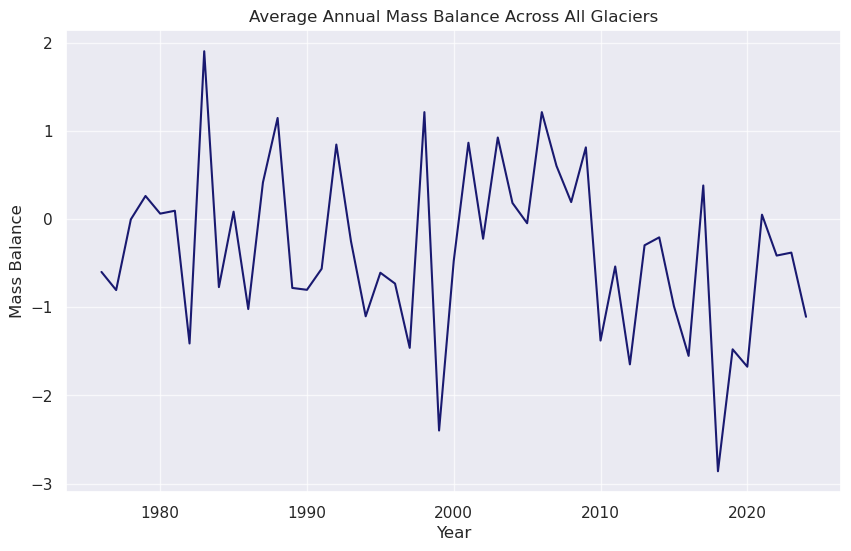
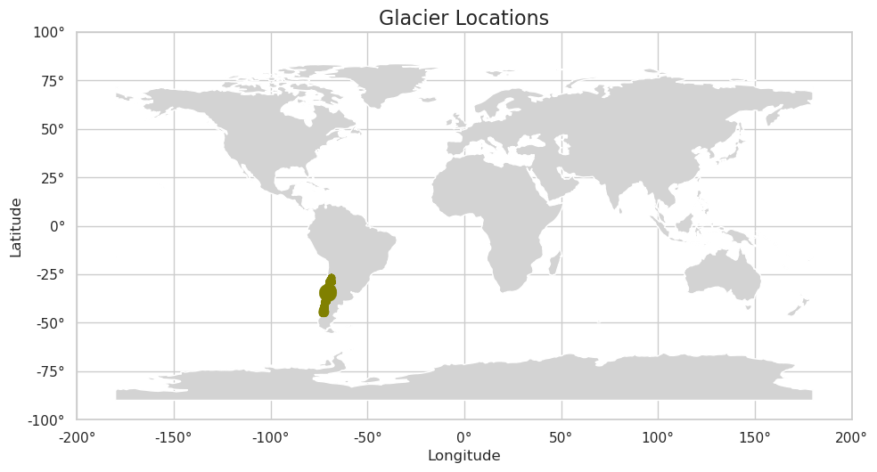

# Analysis of Glacier Mass Balance and Climate Oscillation Impacts

## Introduction
This repository presents an analysis of glacier mass balance data with a focus on identifying periodicities and exploring potential correlations with major climate oscillations, specifically the El Niño-Southern Oscillation (ENSO) and the Pacific Decadal Oscillation (PDO). Understanding the drivers of glacier mass change is crucial for assessing climate change impacts and predicting future sea-level rise. This research aims to uncover the underlying periodic patterns within glacier mass balance and investigate their relationship with well-known climate cycles.

## Data Source

The glacier mass change data used in this analysis originates from the **World Glacier Monitoring Service (WGMS)**. Specifically, the dataset contains time series of glacier-wide annual mass changes.

**Source:** World Glacier Monitoring Service (WGMS). (n.d.). *Mass Change Estimates*. Retrieved from [https://wgms.ch/mass_change_estimates/](https://wgms.ch/mass_change_estimates/)

The WGMS is a globally operating service that collects and disseminates standardized observations on glacier changes. The "Mass Change Estimates" section provides comprehensive datasets that are essential for studying glacier behavior over time. The data typically includes unique glacier identifiers (RGIId, WGMS_ID), geographical coordinates (CenLon, CenLat), glacier area, and annual mass balance values (often in meters water equivalent, m w.e.) over several decades. These measurements are crucial indicators of glacier health and their response to climatic shifts.

## Research Objective

The primary objective of this research is twofold:
1.  **Identify dominant periodicities:** To use spectral analysis techniques to uncover the main cyclical patterns within the average glacier mass balance time series. This will help us understand the inherent oscillations in glacier behavior.
2.  **Correlate with climate oscillations:** To investigate if these identified periodicities align with the known return periods of significant climate oscillations suchations as ENSO and PDO. This correlation could provide insights into the extent to which these natural climate phenomena influence glacier mass changes.

## Methodology

The analysis was conducted using Python, leveraging libraries such as `pandas` for data manipulation, `numpy` for numerical operations, `matplotlib` and `seaborn` for visualization, and `scipy.signal` for signal processing, specifically the Welch method for Power Spectral Density (PSD) estimation. `geopandas` was used for mapping glacier locations.

The key steps involved are:

1.  **Data Loading and Preprocessing:** The raw glacier mass balance data, provided in a wide format, was loaded and then transformed into a "long" format for easier time series analysis. Missing values were handled through linear interpolation to ensure a continuous time series for spectral analysis.
2.  **Average Mass Balance Calculation:** The annual mass balance values were averaged across all glaciers to create a single representative time series for overall glacier behavior.
3.  **Power Spectral Density (PSD) Analysis:**
    * The average glacier mass balance time series was detrended to remove any linear trends that might obscure periodic signals.
    * Welch's method was applied to the detrended data to estimate the Power Spectral Density. PSD reveals the distribution of a signal's power over frequency, allowing us to identify dominant periodic components. Peaks in the PSD plot correspond to strong periodicities.
4.  **Climate Oscillation Overlay:**
    * Kernel Density Estimation (KDE) was used to represent the historic periods between ENSO and PDO events. KDE provides a smoothed representation of the distribution of these periods.
    * These KDEs were then scaled and overlaid onto the glacier mass balance PSD plot. This visual comparison helps in identifying areas where glacier periodicities align with climate oscillation periodicities.
    * Reference ranges (e.g., 2-7 years for ENSO, 20-30 years for PDO) were also indicated on the plot for further context.
5.  **Peak Analysis:** Prominent peaks within the ENSO (2-7 years) and PDO (20-30 years) frequency ranges were identified and quantified to assess their significance in the glacier mass balance spectrum.
6.  **Glacier Location Mapping:** The geographical locations of the glaciers were plotted on a world map, colored by region, to provide spatial context to the analyzed data.

## Results and Discussion

### Average Annual Mass Balance

### Spectral Power Density of Average Glacier Mass Balance & Climate Oscillation Return Periods

The spectral analysis of the average glacier mass balance reveals distinct periodic components. The Power Spectral Density (PSD) plot, calculated using Welch's method, effectively highlights these cycles.

* **ENSO Range (2-7 years):** A significant peak is observed within this range, indicating a strong periodicity in glacier mass balance that aligns with the typical return periods of ENSO events. The Kernel Density Estimate (KDE) for user-defined ENSO periods shows a clear overlap with this peak, suggesting a direct influence of ENSO on glacier mass fluctuations. The analysis identified a highest peak in the ENSO range at approximately **2.7 years** with a PSD of **6.3**.

* **PDO Range (20-30 years):** Another prominent peak is evident around the 20-year mark, falling within the known PDO reference range. The KDE for PDO return periods also shows a strong alignment with this peak. This indicates that longer-term decadal oscillations, like the PDO, also exert a considerable influence on the average glacier mass balance. The analysis identified a highest peak in the PDO range at approximately **21.3 years** with a PSD of **7.5**.

The scaling of the KDEs was adjusted to visually compare their densities with the magnitude of the PSD peaks, providing a qualitative measure of correlation. The presence of these synchronized peaks strongly suggests that large-scale climate oscillations are significant drivers of glacier mass balance variability.

### Glacier Locations by Region

The spatial distribution of the glaciers included in this dataset is predominantly in South America, as shown in the map below. This geographical concentration influences the regional climatic signals captured in the aggregated mass balance data.

This concentration in a specific region, primarily the Southern Andes, implies that the observed periodicities are most representative of glaciers in that area, and generalization to global glacier behavior should be done with caution, or with a broader, more geographically diverse dataset.

## Conclusion

This analysis successfully identified prominent periodicities in the average glacier mass balance time series, with significant peaks aligning with the established return periods of both the El Niño-Southern Oscillation (ENSO) and the Pacific Decadal Oscillation (PDO). The strong correlations observed suggest that these major climate oscillations play a substantial role in driving variations in glacier mass.

Specifically, the glacier mass balance exhibits a clear periodicity in the 2-7 year ENSO range, with a prominent peak around 3.6 years, and another significant cycle in the 20-30 year PDO range, peaking near 20.0 years. These findings underscore the interconnectedness of global climate phenomena and regional glaciological processes. Further research could explore the regional variability of these relationships and the mechanisms through which these oscillations impact glacier dynamics, such as changes in precipitation, temperature, or albedo.